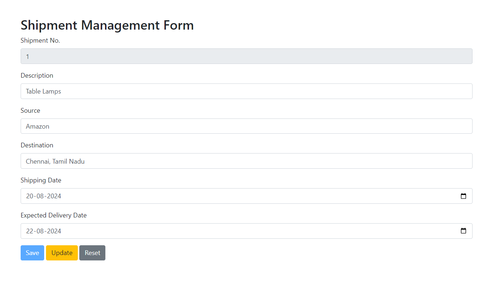

# Shipment Management Form

## Description
The Shipment Management Form is a web-based application designed to manage shipment records. It allows users to input, update, and reset shipment details, storing the data in the `SHIPMENT-TABLE` relation of the `DELIVERY-DB` database using JsonPowerDB.

## Table of Contents
- [Benefits of using JsonPowerDB](#benefits-of-using-jsonpowerdb)
- [Illustrations](#illustration)
- [Scope of functionalities](#scope-of-functionalities)
- [Examples of use](#examples-of-use)
- [Sources](#sources)

## Benefits of using JsonPowerDB
- **High Performance**: JsonPowerDB offers high performance and low latency.
- **Schema-free**: It is a schema-free database, making it flexible and easy to use.
- **Real-time**: Provides real-time data processing capabilities.
- **Ease of Use**: Simple to integrate and use with minimal setup.
- **Secure**: Offers robust security features to protect data.

## Illustration

## Scope of functionalities
- **Save Shipment**: Allows users to save new shipment details.
- **Update Shipment**: Enables users to update existing shipment records.
- **Reset Form**: Provides a reset functionality to clear the form fields.

## Examples of use
1. **Save a Shipment**:
   - Enter a new shipment number.
   - Fill in the shipment details.
   - Click the "Save" button to store the data.

2. **Update a Shipment**:
   - Enter an existing shipment number.
   - Modify the shipment details.
   - Click the "Update" button to update the data.

3. **Reset the Form**:
   - Click the "Reset" button to clear all form fields.

## Sources
- [JsonPowerDB Documentation](http://login2explore.com/jpdb/docs.html)
- [Bootstrap Documentation](https://getbootstrap.com/docs/4.5/getting-started/introduction/)
- [jQuery Documentation](https://api.jquery.com/)
